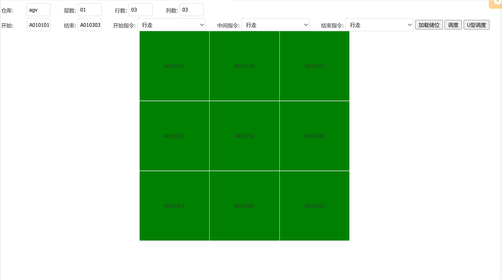

---
### **JEEWMS 开源仓储数字化平台生态体系**

---

#### **✧ 生态连接**
- **技术社区**：QQ交流群① 335607153（已满） ➜ ②群 313930553（技术咨询/实施支持）
- **生态矩阵**：  
  ├─ 智能制造平台 JEEMES 已开源 (https://gitee.com/erzhongxmu/jeemes)  
  ├─ Android移动端开源仓库 [JeeWMSapp-uni](https://gitee.com/erzhongxmu/JeeWMSapp-uni)  
  └─ 在线体验环境：http://47.113.229.131:9080/jeewms (admin/llg123)
- **生态伙伴**： 

---

#### **✧ 价值主张**
**开源仓储中枢系统** | GPL-3.0协议 | 企业级技术栈  
基于Java EE技术栈构建的云端管理平台+UNI-APP智能终端，打造涵盖WMS/OMS/BMS/TMS的仓储数字基座。经冷链/快消/汽车等头部企业验证，提供：  
✅ 多租户架构支持  ✅ 混合云部署方案  ✅ 工业物联网集成（PDA/RFID/AGV）  
✅ 动态计费引擎  ✅ 自动化调度算法  ✅ 商业智能分析

---

#### **✧ 生态合作计划**

**开源共建计划**  
遵循GPL-3.0协议，诚邀开发者：  

- 技术演进路线透明化  
- 企业级Issue响应机制  
- 持续集成版本更新  

**企业级服务**  
华壹智能（官网：(http://www.huayi-tec.com)）提供：  
🔧 工业硬件集成方案（PDA/AGV/RFID最优采购渠道）  
🔧 私有化定制部署  
🔧 系统性能调优服务和咨询服务
📧 商务合作：电话：13850081872 QQ：290813851    

---

#### **✧ 技术全景图**

A[Java技术生态] --> B(SpringMVC+Hibernate，SpringCloud)
A --> C(Redis+Ehcache)
A --> D(Minidao持久层)
B --> E[分布式事务管理]
C --> F[高并发缓存策略]
D --> G[动态SQL引擎]

---

#### **✧ 实施路线图**
1. **环境准备**  
   - JDK1.8 + MySQL5.7（配置优化指南详见文档）
   - 大小写敏感设置与SQL模式调整
2. **快速部署**  
   mvn tomcat7:run   idea springcloud 
3. **数据初始化**  
   - 推荐使用MySQL Workbench进行Schema导入

#### **✧ 行业解决方案**
| 场景        | 技术特征                     | 商业价值                     |
|-------------|------------------------------|------------------------------|
| 冷链物流    | 温控追溯链+批次管理          | 降低损耗率35%+               |
| 汽车制造    | JIT物料协同+AGV调度          | 产线配送效率提升50%          |
| 三方物流    | 动态计费引擎+多货主看板      | 财务处理效率提升60%          |

---

**加入产业数字化革命**  
(http://www.huayi-tec.com)  
华壹智能研发中心持续输出工业4.0智慧仓储解决方案，让每个企业都能享受顶尖的物流数字化能力！

![AGV调度模拟]

![仓位图]

